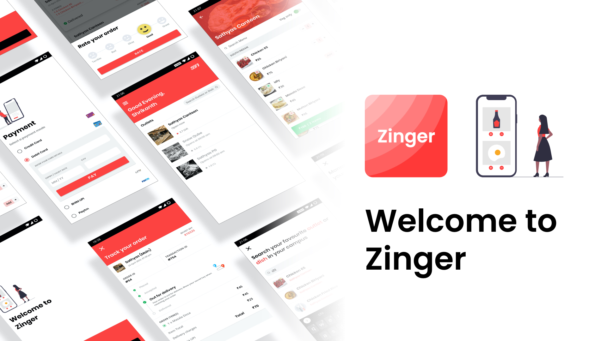

<h1 align="center">
  Zinger Android App
</h1>

<p align="center">
  Join our active, engaged community: <br>
  <strong>
    <a href="https://zinger.pw/app">website</a>
    |
    <a href="https://zinger-workspace.slack.com/join/shared_invite/zt-e6xt0gc2-nBEy85RhEy7NZv3gWCt6Dg/">slack</a>
    |
    <a href="https://discord.gg/TqADaXV">discord</a>
    |
    <a href="https://zinger.pw/app/docs">docs</a>
    |
    <a href="https://zinger.pw">framework</a>
  </strong>
</p>

<p align="center">
  <a href="LICENSE"></a>
  <a href="https://zinger.pw/app/docs"></a>
  <a href="https://github.com/shrikanth7698/Zinger-Android-App/pulls"></a>
  <a href="https://github.com/shrikanth7698/Zinger-Android-App/pulls"></a>
</p>

This is an open source food ordering application developed to showcase the capabilities of <a href="https://zinger.pw" target="_blank">Zinger Framework</a>. This app helps in ordering foods from multiple outlets located in an office, college campus, or food courts in malls. Customers can save themselves a lot of burden from waiting in line to place an order and picking up the order later. They can browse the entire catalog of food items available to them through the app and seamlessly order food from any restaurant of their choice. The app supports both pickup and delivery orders.

This android app uses <a href="https://zinger.pw" target="_blank">Zinger Framework</a> to handle customer side food ordering request. 

## Major libraries used
This Android Application is written in **Kotlin** with **MVVM Architecture** using the following libraries
- Android Architecture Components (ViewModel, LiveData)
- Koin
- Coroutines
- Retrofit
- Picasso

## Key app features
*  Search for restaurants, cuisines, or even a dish
*  Get access to menus, photos, contact details and all the other essential information you need to pick a restaurant.
*  No more calling the restaurant to check if your order is prepared or picked. You’ll be able to track your order in real time.
*  Pay instantly using any digital payment solutions.

## Getting involved
We encourage you to participate in this open source project. We love Pull Requests, Bug Reports, ideas, (security) code reviews or any other kind of positive contribution.

* [View the Docs](https://zinger.pw/app/docs).

* [View current Issues](https://github.com/shrikanth7698/Zinger-Android-App/issues), [view current Pull Requests](https://github.com/shrikanth7698/Zinger-Android-App/pulls).

* [Opt-in](https://join.slack.com/t/zinger-workspace/shared_invite/zt-e6xt0gc2-nBEy85RhEy7NZv3gWCt6Dg) to our slack channel for discussions.

* [Join](https://discord.gg/TqADaXV) our discord channel


## Build Instructions


1. Clone or Download the repository:

    ```shell
    git clone https://github.com/shrikanth7698/Zinger-Android-App.git
    ```

2. Import the project into Android Studio

3. Before running the project, you need to setup the <a href="https://zinger.pw/docs/installation-guide/fork" target="_blank">Zinger Backend Server</a>. Follow the intructions mentioned in this <a href="https://zinger.pw/docs/installation-guide/fork" target="_blank">Link</a> to setup the backend for this android app. 

4. Change the base url in **build.gradle (app level)** to point to the server that you setup in previous step.

    ```gradle
    debug {
        //...
        buildConfigField "String", "CUSTOM_BASE_URL", '"YOUR_BASE_URL"'
    }
    ```

5. Create a firebase project, add this android app to that project:
<a href="https://firebase.google.com/docs/android/setup" target="_blank">Firebase setup</a>

6. Download **google-services.json** from the firebase project you created earlier and add it to the project under **app** folder

7. Enable Phone Number sign-in for your Firebase project

   * In the <a href="https://console.firebase.google.com/" target="_blank">Firebase console</a>, open the **Authentication** section.

   * On the **Sign-in Method** page, enable the **Phone Number** sign-in method.
   
8. Run the project into an emulator or a physical device. 

## Checkout

* <a href="https://github.com/harshavardhan98/Zinger-Seller-App" target="_blank">Zinger Partner App Repo</a>
* <a href="https://zinger.pw" target="_blank">Zinger Framework</a>

## Contributors

* **Shrikanth Ravi** - Android Developer and UI Designer - <a href="https://github.com/shrikanth7698" target="_blank">Github Profile</a>
* **Harshavardhan P** - Android Developer - <a href="https://github.com/harshavardhan98" target="_blank">Github Profile</a>

## Contact Us

* #### StackoverFlow

    You can ask programming-related questions on [Stack Overflow](https://stackoverflow.com/questions/tagged/zinger). Use the `zinger` tag to tag your questions.

* #### Slack

    Join our [Slack](https://zinger-workspace.slack.com/join/shared_invite/zt-e6xt0gc2-nBEy85RhEy7NZv3gWCt6Dg/) group to start collaborating!

* #### Discord

    Chat with our contributors in [Discord](https://discord.gg/TqADaXV) community.

* #### Email

    Send an email to support@zinger.pw with a brief description.

## License
```
MIT License

Copyright (c) 2020 Shrikanth Ravi

Permission is hereby granted, free of charge, to any person obtaining a copy
of this software and associated documentation files (the "Software"), to deal
in the Software without restriction, including without limitation the rights
to use, copy, modify, merge, publish, distribute, sublicense, and/or sell
copies of the Software, and to permit persons to whom the Software is
furnished to do so, subject to the following conditions:

The above copyright notice and this permission notice shall be included in all
copies or substantial portions of the Software.

THE SOFTWARE IS PROVIDED "AS IS", WITHOUT WARRANTY OF ANY KIND, EXPRESS OR
IMPLIED, INCLUDING BUT NOT LIMITED TO THE WARRANTIES OF MERCHANTABILITY,
FITNESS FOR A PARTICULAR PURPOSE AND NONINFRINGEMENT. IN NO EVENT SHALL THE
AUTHORS OR COPYRIGHT HOLDERS BE LIABLE FOR ANY CLAIM, DAMAGES OR OTHER
LIABILITY, WHETHER IN AN ACTION OF CONTRACT, TORT OR OTHERWISE, ARISING FROM,
OUT OF OR IN CONNECTION WITH THE SOFTWARE OR THE USE OR OTHER DEALINGS IN THE
SOFTWARE.
```

[](https://zinger.pw/app) [](https://www.android.com) [](https://github.com/shrikanth7698/Zinger-Android-App/graphs/contributors)
